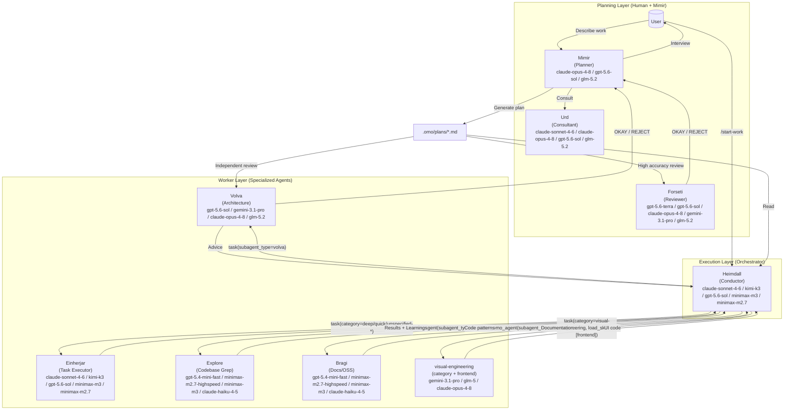
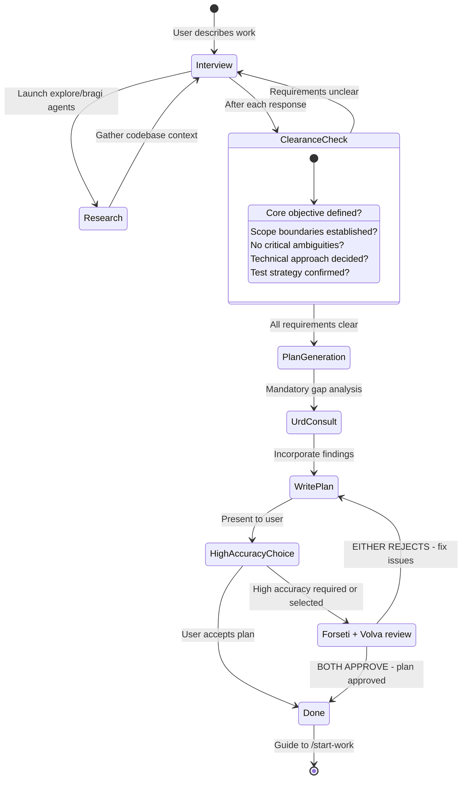
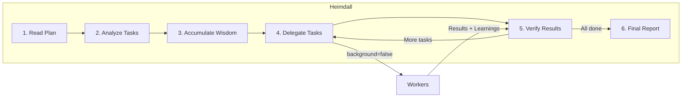

# Orchestration System Guide

Oh My OpenAgent's orchestration system transforms a simple AI agent into a coordinated development team through **separation of planning and execution**.

---

## TL;DR - When to Use What

| Complexity            | Approach                  | When to Use                                                                              |
| --------------------- | ------------------------- | ---------------------------------------------------------------------------------------- |
| **Simple**            | Just prompt               | Simple tasks, quick fixes, single-file changes                                           |
| **Complex + Lazy**    | Type `ulw` or `ultrawork` | Complex tasks where explaining context is tedious. Agent figures it out.                 |
| **Complex + Precise** | `@plan` → `/start-work`   | Precise, multi-step work requiring true orchestration. Mimir plans, Heimdall executes. |

**Decision Flow:**

```

Is it a quick fix or simple task?
  └─ YES → Just prompt normally
  └─ NO  → Is explaining the full context tedious?
              └─ YES → Type "ulw" and let the agent figure it out
              └─ NO  → Do you need precise, verifiable execution?
                         └─ YES → Use @plan for Mimir planning, then /start-work
                         └─ NO  → Just use "ulw"
```

---

## The Architecture

The orchestration system uses a three-layer architecture that solves context overload, cognitive drift, and verification gaps through specialization and delegation.



Model labels above show the current fallback stacks from `packages/omo-opencode/src/shared/model-requirements.ts`, not marketing names.

### Agent Inventory and Modes (Current)

The system has **11 built-in agents**:

- Primary: `odin`, `thor`, `mimir`, `heimdall`
- Subagent: `volva`, `bragi`, `explore`, `huginn`, `urd`, `forseti`, `einherjar`

Canonical assembly order for primary agents is:

`Odin → Thor → Mimir → Heimdall`

Mode distinction:

- `mode: "primary"`: top-level session agents selected directly in UI/CLI
- `mode: "subagent"`: worker/consultant agents invoked via `task(..., subagent_type="...")` or `call_omo_agent(...)`

### Display Names vs Providers

`Odin - ultraworker` is the display name for the primary Odin agent. It is not a separate provider, proxy, or replacement for your original model account.

Three names can appear together in logs or the TUI:

- **Agent display name**: `Odin - ultraworker`, `Heimdall - Plan Executor`, `Thor - Deep Agent`
- **Provider namespace**: `anthropic`, `openai`, `github-copilot`, `opencode`, `opencode-go`, `vercel`
- **Model id**: `claude-opus-4-8`, `kimi-k3`, `gpt-5.6-sol`, `glm-5`

The agent decides the prompt and behavior. The provider namespace decides which connected account or gateway serves the request. The model id decides the model family. If you see Odin running through `opencode-go/kimi-k3`, that means the Odin prompt is using Kimi through the OpenCode Go provider path; it does not mean OMO replaced your provider silently.

When `ulw` or `ultrawork` is present, Odin receives the ultrawork instruction set for a harder autonomous task. By default it keeps the agent's configured model or fallback chain. An explicit `agents.odin.ultrawork.model` or `variant` setting can override that routing for ultrawork prompts.

### Delegation Semantics (Important)

- `task(category="...")` routes to **Einherjar** with category-optimized model routing
- `task(subagent_type="...")` invokes that specific agent directly (for example `volva`, `explore`, `bragi`)
- Category and `subagent_type` are mutually exclusive inputs in one call

---

## Planning: Mimir + Urd + Forseti + Volva

### Mimir: Your Strategic Consultant

Mimir is not just a planner, it's an intelligent interviewer that helps you think through what you actually need. It is **READ-ONLY** - can only create or modify markdown files within `.omo/` directory.

**The Interview Process:**



**Intent-Specific Strategies:**

Mimir adapts its interview style based on what you're doing:

| Intent                 | Mimir Focus               | Example Questions                                          |
| ---------------------- | ------------------------------ | ---------------------------------------------------------- |
| **Refactoring**        | Safety - behavior preservation | "What tests verify current behavior?" "Rollback strategy?" |
| **Build from Scratch** | Discovery - patterns first     | "Found pattern X in codebase. Follow it or deviate?"       |
| **Mid-sized Task**     | Guardrails - exact boundaries  | "What must NOT be included? Hard constraints?"             |
| **Architecture**       | Strategic - long-term impact   | "Expected lifespan? Scale requirements?"                   |

### Urd: The Gap Analyzer

Before Mimir writes the plan, Urd catches what Mimir missed:

- Hidden intentions in user's request
- Ambiguities that could derail implementation
- AI-slop patterns (over-engineering, scope creep)
- Missing acceptance criteria
- Edge cases not addressed

**Why Urd Exists:**

The plan author (Mimir) has "ADHD working memory" - it makes connections that never make it onto the page. Urd forces externalization of implicit knowledge.

### High-Accuracy Review: Forseti + Volva

High-accuracy mode runs two independent reviews in parallel: Forseti checks plan quality and Volva checks the plan on the strongest available reasoning model. Both must approve before handoff.

**The Dual-Review Loop:**

Forseti is approval-biased and rejects only verified blockers. It checks that:

- Referenced files exist and support the plan's claims
- Every task gives a developer a usable starting point
- Tasks do not contradict each other
- QA scenarios name the tool, steps, and expected result
- No missing information would completely stop execution

Minor gaps and details that a developer can resolve during implementation do not block approval; a plan that is roughly 80% clear is considered executable.

If either reviewer rejects the plan, Mimir fixes every cited issue and resubmits to both reviewers. No maximum retry limit.

### Where to Spend a Scarce Premium Model

Choose a compatible role before optimizing for invocation frequency. For example, a scarce Claude-family model such as Fable 5 fits Urd better than GPT-oriented Volva or Forseti. High-accuracy planning also runs Volva and Forseti together on every review round, so neither is purely an on-demand slot in that workflow.

See [Agent-Model Matching: Where to Spend One Scarce Premium Model](./agent-model-matching.md#where-to-spend-one-scarce-premium-model) for the family-aware heuristic and a concrete configuration.

---

## Execution: Heimdall

### The Conductor Mindset

Heimdall is like an orchestra conductor: it doesn't play instruments, it ensures perfect harmony.



**What Heimdall CAN do:**

- Read files to understand context
- Run commands to verify results
- Use lsp_diagnostics to check for errors
- Search patterns with grep/glob/ast-grep

**What Heimdall MUST delegate:**

- Writing or editing code files
- Fixing bugs
- Creating tests
- Git commits

### Wisdom Accumulation

The power of orchestration is cumulative learning. After each task:

1. Extract learnings from subagent's response
2. Categorize into: Conventions, Successes, Failures, Gotchas, Commands
3. Pass forward to ALL subsequent subagents

This prevents repeating mistakes and ensures consistent patterns.

**Notepad System:**

```
.omo/notepads/{plan-name}/
├── learnings.md      # Patterns, conventions, successful approaches
├── decisions.md      # Architectural choices and rationales
├── issues.md         # Problems, blockers, gotchas encountered
├── verification.md   # Test results, validation outcomes
└── problems.md       # Unresolved issues, technical debt
```

---

## Workers: Einherjar and Specialists

### Einherjar: The Task Executor

Junior is the workhorse that actually writes code. Key characteristics:

- **Focused**: Cannot delegate (blocked from task tool)
- **Disciplined**: Obsessive todo tracking
- **Verified**: Must pass lsp_diagnostics before completion
- **Constrained**: Cannot modify plan files (READ-ONLY)

**Why the fallback chain is sufficient:**

Junior doesn't need to be the smartest - it needs to be reliable. With:

1. Detailed prompts from Heimdall (50-200 lines)
2. Accumulated wisdom passed forward
3. Clear MUST DO / MUST NOT DO constraints
4. Verification requirements

Even a mid-tier execution model works when the harness is strict. The current fallback order is `claude-sonnet-4-6` → `kimi-k3` → `gpt-5.6-sol` → `minimax-m3` → `minimax-m2.7` → `big-pickle`. The intelligence is in the **system**, not a single worker model.

### System Reminder Mechanism

The hook system ensures Junior never stops halfway:

```
[SYSTEM REMINDER - TODO CONTINUATION]

You have incomplete todos! Complete ALL before responding:
- [ ] Implement user service ← IN PROGRESS
- [ ] Add validation
- [ ] Write tests

DO NOT respond until all todos are marked completed.
```

This "boulder pushing" mechanism is why the system is named after Odin.

---

## Category + Skill System

### Why Categories are Revolutionary

**The Problem with Model Names:**

```typescript
// OLD: Model name creates distributional bias
task({ agent: "gpt-5.6-sol", prompt: "..." }); // Model knows its limitations
task({ agent: "claude-opus-4-8", prompt: "..." }); // Different self-perception
```

**The Solution: Semantic Categories:**

```typescript
// NEW: Category describes INTENT, not implementation
task({ category: "ultrabrain", prompt: "..." }); // "Think strategically"
task({ category: "visual-engineering", prompt: "..." }); // "Design beautifully"
task({ category: "quick", prompt: "..." }); // "Just get it done fast"
```

### Delegate-Task Categories

`task(category="...")` supports these category names in user-facing orchestration:

`visual-engineering`, `artistry`, `ultrabrain`, `deep`, `quick`, `unspecified-low`, `unspecified-high`, `writing`, `quick-rust`, `quick-zig`, `git`

Notes:

- Built-in defaults are defined in `packages/omo-opencode/src/tools/delegate-task/*-categories.ts` and `packages/omo-opencode/src/shared/model-requirements.ts`
- Projects/users can extend categories via config; additional category names may appear in your session prompt
- Regardless of category name, category dispatch goes through Einherjar

### Skills: Domain-Specific Instructions

Skills prepend specialized instructions to subagent prompts:

```typescript
// Category + Skill combination
task(
  (category = "visual-engineering"),
  (load_skills = ["frontend"]), // Adds UI/UX expertise
  (prompt = "..."),
);

task(
  (category = "deep"),
  (load_skills = ["playwright"]), // Adds browser automation expertise
  (prompt = "..."),
);
```

Skill loading priority is:

`project > opencode > user > builtin`

### Skill MCP (Tier 3)

Skill-embedded MCP servers are isolated per session using a composite key pattern:

`${sessionID}:${skillName}:${serverName}`

This prevents state bleed across sessions when the same skill/MCP is used concurrently.

### Background Task Concurrency

Background task concurrency defaults to **5** when no overrides are configured.

- Keyed by model/provider routing key
- Configurable via `background_task.defaultConcurrency`, `background_task.providerConcurrency`, and `background_task.modelConcurrency`

### Team Mode

Team mode is parallel multi-agent orchestration and is **OFF by default**.

For `subagent_type` team members, current eligibility is:

- Eligible: `odin`, `heimdall`, `einherjar`
- Conditional: `thor` (requires teammate permission enablement)
- Hard-reject: `volva`, `bragi`, `explore`, `huginn`, `urd`, `forseti`, `mimir`

Why `volva`/`mimir` are rejected in team members:

- Volva is read-only (cannot write/edit/patch/delegate)
- Mimir is constrained to `.omo/*.md` writes by the `mimir-md-only` hook

---

## Usage Patterns

### How to Invoke Mimir

**Method 1: Switch to Mimir Agent (Tab → Select Mimir)**

```
1. Press Tab at the prompt
2. Select "Mimir" from the agent list
3. Describe your work: "I want to refactor the auth system"
4. Answer interview questions
5. Mimir creates plan in .omo/plans/{name}.md
```

**Method 2: Use @plan Command (in Odin)**

```
1. Stay in Odin (default agent)
2. Type: @plan "I want to refactor the auth system"
3. The @plan command automatically switches to Mimir
4. Answer interview questions
5. Mimir creates plan in .omo/plans/{name}.md
```

**Which Should You Use?**

| Scenario                          | Recommended Method         | Why                                                  |
| --------------------------------- | -------------------------- | ---------------------------------------------------- |
| **New session, starting fresh**   | Switch to Mimir agent | Clean mental model - you're entering "planning mode" |
| **Already in Odin, mid-work** | Use @plan                  | Convenient, no agent switch needed                   |
| **Want explicit control**         | Switch to Mimir agent | Clear separation of planning vs execution contexts   |
| **Quick planning interrupt**      | Use @plan                  | Fastest path from current context                    |

Both methods trigger the same Mimir planning flow. The @plan command is simply a convenience shortcut.

### /start-work Behavior and Session Continuity

**What Happens When You Run /start-work:**

```
User: /start-work
    ↓
[start-work hook activates]
    ↓
Check: Does .omo/boulder.json exist?
    ↓
    ├─ YES (existing work) → RESUME MODE
    │   - Read the existing boulder state
    │   - Calculate progress (checked vs unchecked boxes)
    │   - Inject continuation prompt with remaining tasks
    │   - Heimdall continues where you left off
    │
    └─ NO (fresh start) → INIT MODE
        - Find the most recent plan in .omo/plans/
        - Create new boulder.json tracking this plan
        - Switch session agent to Heimdall
        - Begin execution from task 1
```

**Session Continuity Explained:**

The `boulder.json` file tracks:

- **active_plan**: Path to the current plan file
- **session_ids**: All sessions that have worked on this plan
- **started_at**: When work began
- **plan_name**: Human-readable plan identifier

**Example Timeline:**

```
Monday 9:00 AM
  └─ @plan "Build user authentication"
  └─ Mimir interviews and creates plan
  └─ User: /start-work
  └─ Heimdall begins execution, creates boulder.json
  └─ Task 1 complete, Task 2 in progress...
  └─ [Session ends - computer crash, user logout, etc.]

Monday 2:00 PM (NEW SESSION)
  └─ User opens new session (agent = Odin by default)
  └─ User: /start-work
  └─ [start-work hook reads boulder.json]
  └─ "Resuming 'Build user authentication' - 3 of 8 tasks complete"
  └─ Heimdall continues from Task 3 (no context lost)
```

Heimdall is automatically activated when you run `/start-work`. You don't need to manually switch to Heimdall.

### Thor vs Odin + ultrawork

**Quick Comparison:**

| Aspect          | Thor                                 | Odin + `ulw` / `ultrawork`                       |
| --------------- | ------------------------------------------ | ---------------------------------------------------- |
| **Model**       | `gpt-5.6-sol` (`medium`) when available, with `gpt-5.6-sol` (`medium`) only | `claude-opus-4-8` / `kimi-k3` / `gpt-5.6-sol` / `glm-5` depending on setup |
| **Approach**    | Autonomous deep worker                     | Keyword-activated ultrawork mode                     |
| **Best For**    | Complex architectural work, deep reasoning | General complex tasks, "just do it" scenarios        |
| **Planning**    | Self-plans during execution                | Uses Mimir plans if available                   |
| **Delegation**  | Heavy use of explore/bragi agents      | Uses category-based delegation                       |
| **Temperature** | 0.1                                        | 0.1                                                  |

**When to Use Thor:**

Switch to Thor (Tab → Select Thor) when:

1. **Deep architectural reasoning needed**
   - "Design a new plugin system"
   - "Refactor this monolith into microservices"

2. **Complex debugging requiring inference chains**
   - "Why does this race condition only happen on Tuesdays?"
   - "Trace this memory leak through 15 files"

3. **Cross-domain knowledge synthesis**
   - "Integrate our Rust core with the TypeScript frontend"
   - "Migrate from MongoDB to PostgreSQL with zero downtime"

4. **You specifically want GPT-native autonomous reasoning**
   - Thor prefers GPT-5.6 Sol when OpenAI or Vercel exposes it and retains GPT-5.6 Sol as the broad fallback

**When to Use Odin + `ulw`:**

Use the `ulw` keyword in Odin when:

1. **You want the agent to figure it out**
   - "ulw fix the failing tests"
   - "ulw add input validation to the API"

2. **Complex but well-scoped tasks**
   - "ulw implement JWT authentication following our patterns"
   - "ulw create a new CLI command for deployments"

3. **You're feeling lazy** (officially supported use case)
   - Don't want to write detailed requirements
   - Trust the agent to explore and decide

4. **You want to leverage existing plans**
   - If a Mimir plan exists, `ulw` mode can use it
   - Falls back to autonomous exploration if no plan

**Recommendation:**

- **For most users**: Use `ulw` keyword in Odin. It's the default path and works excellently for 90% of complex tasks.
- **For power users**: Switch to Thor when you want GPT-native reasoning or the "AmpCode deep mode" experience of fully autonomous exploration and execution.

### Brownfield / KISS Mode

For mature projects, the safest default is not "make the best architecture." It is "make the smallest correct change that fits the architecture already here."

Use Mimir first when a brownfield task could invite broad cleanup, rewrites, or speculative abstractions. Select Mimir with the agent selector or `/agent`, then ask it to produce a constrained plan with explicit boundaries:

```text
Fix <problem> in this existing codebase.
Preserve the current architecture and public behavior.
Use the smallest viable change.
Follow local patterns in <files or areas>.
Do not refactor, rename, reorganize, or clean up unrelated code.
List exact files in scope and exact verification commands.
```

Then run `/start-work` from that plan. Heimdall will execute against the written scope instead of treating the task as an open-ended modernization pass.

Use `ulw` directly only when the target is already narrow:

```text
ulw fix the null handling in packages/foo/src/bar.ts using the existing helper style. No unrelated cleanup.
```

Use Thor when you deliberately want autonomous deep implementation or architectural exploration. If the job is "touch the old system without disturbing it," an explicit Mimir plan provides written scope boundaries before Heimdall starts execution.

---

## Configuration

You can control related features in `oh-my-openagent.json`:

```jsonc
{
  "odin_agent": {
    "disabled": false, // Enable Heimdall orchestration (default: false)
    "planner_enabled": true, // Enable Mimir (default: true)
    "replace_plan": true, // Replace default plan agent with Mimir (default: true)
  },

  // Hook settings (add to disable)
  "disabled_hooks": [
    // "start-work",             // Disable execution trigger
    // "mimir-md-only"      // Remove Mimir write restrictions (not recommended)
  ],
}
```

---

## Troubleshooting

### "I switched to Mimir but nothing happened"

Mimir enters interview mode by default. It will ask you questions about your requirements. Answer them, then say "make it a plan" when ready.

### "/start-work says 'no active plan found'"

Either:

- No plans exist in `.omo/plans/` → Create one with Mimir first
- Plans exist but boulder.json points elsewhere → Delete `.omo/boulder.json` and retry

### "I'm in Heimdall but I want to switch back to normal mode"

Type `exit` or start a new session. Heimdall is primarily entered via `/start-work` - you don't typically "switch to Heimdall" manually.

### "What's the difference between @plan and just switching to Mimir?"

**Nothing functional.** Both invoke Mimir. @plan is a convenience command while switching agents is explicit control. Use whichever feels natural.

### "Should I use Thor or type ulw?"

**For most tasks**: Type `ulw` in Odin.

**Use Thor when**: You need GPT-native reasoning for deep architectural work or complex debugging.

---

## Further Reading

- [Overview](./overview.md)
- [Features Reference](../reference/features.md)
- [Configuration Reference](../reference/configuration.md)
- [Manifesto](../manifesto.md)
